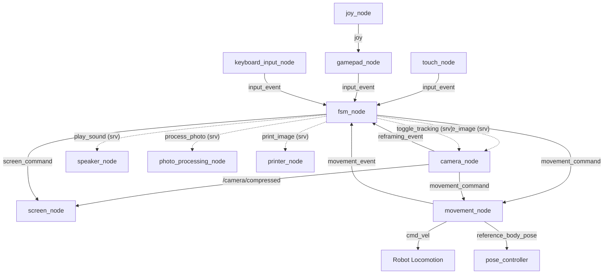

# Pupper Delivery Bot Repo
[](https://github.com/miyatakazuya/photo-pupper/actions/workflows/ros2_ci.yml)

Contributors: Kazuya Miyata, Kane Li, Austin Choi

An interactive, multi-node ROS 2 photobooth system built for the Mini Pupper robot. It coordinates an LCD screen interface, USB speaker audio prompts, a DepthAI-powered OAK-D camera for human tracking/reframing, various inputs (gamepad, keyboard, GPIO touch buttons), an image compositing/overlay pipeline, and a thermal printer.

---

## Directory Structure

```
.
├── CMakeLists.txt
├── package.xml
├── README.md
├── setup.cfg
├── setup.py
├── config/
│   └── node_config.yml    # Configuration file for disabling/enabling nodes and editing parameters
├── launch/
│   └── photobooth_launch.py # Dynamically launches nodes based on node_config.yml
├── photo_pupper/          # ROS 2 Python Node Source Files
│   ├── __init__.py
│   ├── camera_node.py     # Captures frames, runs person tracking/reframing
│   ├── fsm_node.py        # Central Finite State Machine logic
│   ├── gamepad_node.py    # Subscribes to /joy, publishes gamepad events
│   ├── keyboard_input_node.py # Standard keyboard simulation input for testing
│   ├── movement_node.py   # Drives robot base velocity and body pose sequences
│   ├── photo_processing_node.py # Pillow-based overlay decorator
│   ├── printer_node.py    # Thermal printing driver interfacing with CUPS
│   ├── screen_node.py     # Mini Pupper LCD display controller
│   ├── speaker_node.py    # PlaySound server utilizing sounddevice
│   └── touch_node.py      # GPIO touch panel driver
├── resource/
│   └── photo_pupper
├── srv/                   # Custom Service Interface Definitions
│   ├── PlaySound.srv
│   ├── PrintImage.srv
│   ├── ProcessPhoto.srv
│   └── SaveImage.srv
└── test/
    ├── test_copyright.py
    ├── test_flake8.py
    └── test_pep257.py
```

---

## Architecture & Node Specifications

The photobooth runs as a distributed network of ROS 2 nodes, orchestrated by a central Finite State Machine (`fsm_node`):



### 1. `fsm_node`
* **Purpose**: The central coordinator that executes the photobooth's finite state machine.
* **Key States**: Consent check, mood choice (Happy, Silly, Sad, Serious), pose recommendation, human tracking, countdown, camera frame save, overlay review, print review, CUPS print spooling, and goodbye.
* **Subscribed Topics**:
  * `input_event` (`std_msgs/msg/String`)
  * `movement_event` (`std_msgs/msg/String`)
  * `reframing_event` (`std_msgs/msg/String`)
* **Published Topics**:
  * `screen_command` (`std_msgs/msg/String`)
  * `movement_command` (`std_msgs/msg/String`)
* **Service Clients**:
  * `play_sound` (`photo_pupper/srv/PlaySound`)
  * `save_image` (`photo_pupper/srv/SaveImage`)
  * `toggle_tracking` (`std_srvs/srv/SetBool`)
  * `process_photo` (`photo_pupper/srv/ProcessPhoto`)
  * `print_image` (`photo_pupper/srv/PrintImage`)

### 2. `camera_node`
* **Purpose**: Configures and starts the OAK-D camera using DepthAI. Performs spatial detection and people tracking.
* **Published Topics**:
  * `/camera/compressed` (`sensor_msgs/msg/CompressedImage`)
  * `movement_command` (`std_msgs/msg/String`) — issues angular/linear correction commands (e.g. `turn_left`, `turn_right`, `recenter`, `reposition`)
  * `reframing_event` (`std_msgs/msg/String`) — signals completion with `"REFRAMING_COMPLETE"`
* **Service Servers**:
  * `toggle_tracking` (`std_srvs/srv/SetBool`) — enables/disables automatic reframing logic
  * `save_image` (`photo_pupper/srv/SaveImage`) — saves the current raw RGB camera frame

### 3. `movement_node`
* **Purpose**: Coordinates Mini Pupper's movement sequences and poses (e.g., nods, success dances, wagging, head tilts, body adjustments).
* **Subscribed Topics**:
  * `movement_command` (`std_msgs/msg/String`)
* **Published Topics**:
  * `movement_event` (`std_msgs/msg/String`) — publishes `"MOVEMENT_COMPLETE"` once a motion sequence ends
  * `cmd_vel` (`geometry_msgs/msg/Twist`) — base translation and rotation velocity
  * `reference_body_pose` (`geometry_msgs/msg/Pose`) — body posture commands sent to the Mini Pupper dance/pose controller

### 4. `screen_node`
* **Purpose**: Drives the Mini Pupper LCD display using the Pillow/PIL library. Renders animations, static instruction cards, countdowns, and displays live compressed video from the camera feed.
* **Subscribed Topics**:
  * `screen_command` (`std_msgs/msg/String`)
  * `/camera/compressed` (`sensor_msgs/msg/CompressedImage`)

### 5. `speaker_node`
* **Purpose**: Interfaces with a USB speaker to play WAV audio clips (voice instructions, beep cues, music) during transitions.
* **Service Servers**:
  * `play_sound` (`photo_pupper/srv/PlaySound`)

### 6. `photo_processing_node`
* **Purpose**: Composites overlay borders, text labels, and graphic frames onto saved raw photos.
* **Service Servers**:
  * `process_photo` (`photo_pupper/srv/ProcessPhoto`)

### 7. `printer_node`
* **Purpose**: Spools raw/decorated images to a thermal printer using a CUPS printer print job.
* **Service Servers**:
  * `print_image` (`photo_pupper/srv/PrintImage`)

### 8. `touch_node`
* **Purpose**: Reads GPIO signals from Mini Pupper's hardware touch panel.
* **Published Topics**:
  * `input_event` (`std_msgs/msg/String`) — publishes `"INPUT_CONFIRM"` or `"INPUT_NEXT"` based on physical interaction.

### 9. `gamepad_node`
* **Purpose**: Listens to gamepad controller buttons and maps them to input events.
* **Subscribed Topics**:
  * `joy` (`sensor_msgs/msg/Joy`)
* **Published Topics**:
  * `input_event` (`std_msgs/msg/String`)

### 10. `keyboard_input_node`
* **Purpose**: Provides a local terminal CLI keyboard interface for testing/debugging photobooth sequences without physical sensors or gamepad connected.
* **Published Topics**:
  * `input_event` (`std_msgs/msg/String`)

---

## Custom Service Specifications

### 1. `/play_sound` (`photo_pupper/srv/PlaySound`)
* **Request**:
  * `string sound_path` - The absolute target path of the WAV file to play.
* **Response**:
  * `bool success` - True if audio successfully loaded and played.
  * `string message` - Log messages or error diagnostics.

### 2. `/print_image` (`photo_pupper/srv/PrintImage`)
* **Request**:
  * `string image_path` - Absolute path of the image file to print.
  * `string media_size` - Size parameter string (e.g. `"w50h60"`, `"w50h150"`).
* **Response**:
  * `bool success` - True if queued to CUPS spooler.
  * `string message` - Spooler log message or details on failure.

### 3. `/process_photo` (`photo_pupper/srv/ProcessPhoto`)
* **Request**:
  * `string input_path` - Absolute path of the raw photo to edit.
  * `uint8 overlay_type` - Choice of visual frame decoration:
    * `OVERLAY_NONE = 0`
    * `OVERLAY_FLOWERS = 1`
    * `OVERLAY_STARS = 2`
    * `OVERLAY_PARTY = 3`
    * `OVERLAY_COMIC = 4`
    * `OVERLAY_CLOUDS = 5`
    * `OVERLAY_CONFETTI = 6`
    * `OVERLAY_SAD_CLOUD = 7`
    * `OVERLAY_RAIN = 8`
    * `OVERLAY_BROKEN_HEART = 9`
    * `OVERLAY_BLACK_WHITE = 10`
    * `OVERLAY_CAUTION = 11`
    * `OVERLAY_LOCKED_IN = 12`
  * `string output_path` - Optional custom file path to save output (generates default temporary path if empty).
* **Response**:
  * `bool success` - True if overlay compositing succeeded.
  * `string message` - Log output or warning message.
  * `string processed_path` - Final path of the saved composited photo.

### 4. `/save_image` (`photo_pupper/srv/SaveImage`)
* **Request**:
  * `string filename` - Name or path where the latest camera frame should be saved.
* **Response**:
  * `bool success` - True if image saved.
  * `string message` - Error logs or status info.

---

## Configuration Settings

You can customize node parameters in the configuration file: `config/node_config.yml`

```yaml
# Toggle Nodes (1 is activated)
photobooth_nodes:
  fsm_node:
    enabled: 1
    parameters:
      enable_movement: true
  gamepad_node: 1
  movement_node:
    enabled: 1
    parameters:
      real_movement: true
      enable_logging: true
      linear_speed: 0.07
      side_speed: 0.06
      turn_speed: 0.4
      step_seconds: 0.4
      pose_seconds: 0.4
  camera_node:
    enabled: 1
    parameters:
      publishing: true
      turn_threshold: 0.15
      hz: 4.0
      centered_frames_required: 4
  photo_processing_node: 1
  printer_node: 1
  screen_node: 1
  touch_node: 0
  speaker_node:
    enabled: 1
    parameters:
      volume_percent: 50
  pose_controller:
    enabled: 1
    package: mini_pupper_dance
    executable: pose_controller
  joy_node:
    enabled: 1
    package: joy
    executable: joy_node
    parameters:
      device_id: 0
      autorepeat_rate: 20.0
```

---

## Hardware Integration & Setup

### 1. Printer Setup
We used a **Phomemo T02 Thermal Printer** using this [CUPS driver](https://github.com/vivier/phomemo-tools).
To set up, follow the instructions in the driver repository to install the CUPS driver for the T02. Once configured, ensure `printer_node.py` is enabled in `node_config.yml`.

### 2. Camera Setup
Ensure the OAK-D spatial depth camera is connected. The system utilizes DepthAI packages to process face tracking and object distance measurement.

### 3. Audio Speaker Setup
Ensure a USB speaker is connected to the Mini Pupper. The `speaker_node` uses `amixer` commands to unmute the channels and the `sounddevice` package for audio playback.

### 4. Touch Panel Setup
The physical button panel uses Mini Pupper GPIO pins 3 and 6. Ensure `RPi.GPIO` is installed on the robot. If not found, a mock GPIO layer will initialize for desktop simulation.

---

## Execution Guide

### Build the Package
```bash
# Sourcing ROS 2 environment
source /opt/ros/humble/setup.bash

# Build the workspace containing photo_pupper
colcon build --packages-select photo_pupper
source install/setup.bash
```

### Running the Photobooth
To start the system, open multiple terminal windows or execute a launcher:

#### Terminal 1: Robot Bringup
Starts the locomotion drivers for Mini Pupper:
```bash
source ~/ros2_ws/install/setup.bash
ros2 launch mini_pupper_bringup bringup.launch.py
```

#### Terminal 2: Full Photobooth Launch
Launches the custom FSM, cameras, printer, screen, speaker, and config nodes:
```bash
source ~/ros2_ws/install/setup.bash
ros2 launch photo_pupper photobooth_launch.py
```

#### Terminal 3: Gamepad Controller Connectivity (Optional)
```bash
bluetoothctl
connect 8C:41:F2:6B:1C:DC
```
